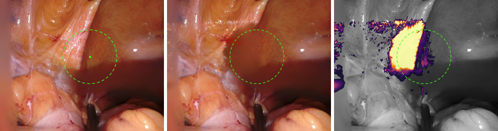

# GC-EndoGaussian

### Residual-Centered Sparse Control for Editable Endoscopic 4D Gaussian Reconstruction

GC-EndoGaussian adds a **sparse, editable control layer** to dynamic 4D Gaussian
Splatting for endoscopic scene reconstruction. It merges the dense per-Gaussian
deformation field of [**EndoGaussian**](http://arxiv.org/abs/2401.12561) with the
sparse control-node interface of [**SC-GS**](https://yihua7.github.io/SC-GS-web/),
so a trained reconstruction can be **edited at inference time — no retraining** —
while staying within a small, bounded fidelity cost of the dense baseline.

The main finding is deliberately un-flashy and honest: the component that avoids the
fidelity loss usually incurred by sparse-control models is a **dense per-Gaussian
residual**, *not* the graph architecture (which we find interchangeable). This makes
the recipe transferable to other sparse-control designs.

> **Note.** This repository is built directly on the **official
> [EndoGaussian](https://github.com/yifliu3/EndoGaussian) codebase** — the base
> reconstruction, training/rendering pipeline, and CUDA rasterizer are EndoGaussian's.
> GC-EndoGaussian adds the sparse control-node layer, the per-Gaussian residual, and the
> editing/evaluation tooling on top; the sparse-control-and-skinning paradigm follows
> [SC-GS](https://github.com/yihua7/SC-GS). The stack was also migrated from the original
> Python 3.7 / PyTorch 1.13 environment to Python 3.12 / PyTorch 2.5 (see Setup).



*Editable tissue retraction on `cutting_tissues_twice`: a local group of control nodes
(dashed outline) is dragged laterally at inference time, retracting the overlying
tissue to reveal the region behind — left: before · middle: after · right: per-pixel
edit magnitude. Controllable visibility only; tissue mechanics are not modeled.*

<!-- > **Demo videos** (in [`docs/supplementary/`](docs/supplementary/)):
> [`demoF2.mp4`](docs/supplementary/demoF2.mp4) — full walkthrough (generality →
> the residual finding → editability) with the edit reveal appended ·
> [`edit_reveal_cutting_seq.mp4`](docs/supplementary/edit_reveal_cutting_seq.mp4) —
> the lateral retraction applied *during* live 4D playback. -->

---

## 🔑 Key results

Verified on EndoNeRF (`pulling_soft_tissues`, `cutting_tissues_twice`) and four SuPer
tracking trials. Full tables and discussion in the [paper](docs/paper_v2.md).

**Reconstruction — editability at a bounded cost vs. the dense baseline**

| Scene | Fine iters | EndoGaussian (PSNR) | GC-EndoGaussian (PSNR) | ΔPSNR |
|---|---:|---:|---:|---:|
| pulling | 3000 | 37.27 | 37.00 | **−0.27** |
| pulling | 6000 | 37.32 | 37.17 | **−0.15** |
| cutting | 6000 | 39.42 | 39.29 | **−0.13** |

- **205 FPS** (from 285 FPS) and **+0.07%** deformation parameters (85.29 M → 85.35 M).
- **Tracking:** no statistically significant difference from EndoGaussian on SuPer
  (median RPE 3.30 vs 3.47 px; paired Wilcoxon *p = 0.73*).

**The residual is the load-bearing component** (residual-isolation ablation, `pulling`
3000 iters / SuPer trial 3):

| Model | PSNR ↑ | Track RPE ↓ |
|---|---:|---:|
| SC-GS-style, **no** residual | 36.80 | 7.02 px |
| SC-GS-style **+ residual**   | **37.29** | **3.41 px** |

Adding the dense per-Gaussian residual recovers near-baseline fidelity **without**
adopting the graph message passing or translation-only control — the finding
generalizes beyond this particular implementation.

---

## ⚙️ Setup
```bash
git clone --recurse-submodules <this-repo>
cd EndoGaussian
git submodule update --init --recursive
conda create -n EndoGaussian python=3.12
conda activate EndoGaussian

# Install PyTorch first from the CUDA 12.1 wheel index so the local-version tags resolve correctly.
pip install torch==2.5.1 torchvision==0.20.1 torchaudio==2.5.1 --index-url https://download.pytorch.org/whl/cu121
pip install -r requirements.txt

# The two CUDA submodules are compiled against the installed PyTorch.
pip install -e submodules/depth-diff-gaussian-rasterization
pip install -e submodules/simple-knn
```
This fork has been migrated from the original Python 3.7 / PyTorch 1.13.1 / CUDA 11.7
stack to **Python 3.12 / PyTorch 2.5.1 / CUDA 12.1**. The `mmcv` dependency was removed;
per-scene `.py` configs are now loaded via a small stdlib helper in
[utils/config_loader.py](utils/config_loader.py). On a different CUDA toolkit, swap the
wheel index (`cu118`, `cu124`, …) and rebuild the two submodules.

## 📚 Data Preparation
**EndoNeRF:** the two accessible clips (`pulling_soft_tissues`, `cutting_tissues_twice`)
from [EndoNeRF](https://github.com/med-air/EndoNeRF). For a one-command fetch of the
`pulling` clip into the expected layout, see `tools/download_endonerf_pulling.bash`.

**SCARED:** sign the [challenge](https://endovissub2019-scared.grand-challenge.org/)
rules (email max.allan@intusurg.com) and follow
[MICCAI_challenge_preprocess](https://github.com/EikoLoki/MICCAI_challenge_preprocess).

**Hamlyn:** the version provided by [Forplane](https://github.com/Loping151/ForPlane).

**SuPer (tracking):** four da Vinci tissue-manipulation trials with annotated points,
converted into the reconstruction pipeline (stereo-SGBM depth + tool masks + static
poses). Used for the tracking evaluation only.

Resulting file structure:
```
├── data
│   ├── endonerf
│   │   ├── pulling
│   │   └── cutting
│   ├── scared
│   │   └── dataset_1/keyframe_1/data ...
│   └── hamlyn
│       └── hamlyn_seq1 ...
```

## ⏳ Training

**Base EndoGaussian** (dense deformation, no control layer):
```
python train.py -s data/endonerf/pulling --port 6017 --expname endonerf/pulling \
    --configs arguments/endonerf/pulling.py
```

**GC-EndoGaussian** (the editable *match* recipe — translation-only control + dense
residual + fixed nodes). Use the `*_graph_match.py` configs:
```
python train.py -s data/endonerf/pulling --port 6600 --expname endonerf/pulling_match \
    --configs arguments/endonerf/pulling_graph_match.py --save_iterations 1000 6000
```
Relevant configs under `arguments/endonerf/`: `*_graph_match.py` (final model),
`*_graph_scgs.py` (SC-GS-style baseline), `*_graph_scgs_hybrid.py` (SC-GS-style +
residual, the isolation ablation), `*_graph_nognn.py` (message-passing removed).
The two-stage `sbatch` runners are `run_gc_match.bash` (train + render + metrics) and
friends; SLURM is required (the rasterizer is CUDA).

## 🎇 Rendering & Reconstruction
```
python render.py --model_path output/endonerf/pulling_match \
    --configs arguments/endonerf/pulling_graph_match.py --iteration 6000 \
    --skip_train --skip_video
```
`--skip_train / --skip_test / --skip_video` suppress the corresponding sets (all three
render by default); add `--reconstruct` to export a point cloud.

## 📏 Evaluation
```
python metrics.py --model_path output/endonerf/pulling_match
```
Reports PSNR / SSIM / LPIPS / depth-RMSE on held-out frames.

## ✏️ Editing & demo videos

Apply inference-time control-node drags to a trained *match* model and render the edit
figure (before + magnitude/direction sweep + edit-magnitude heatmap):
```
python tools/edit_figure.py --model_path output/endonerf/cutting_match \
    --configs arguments/endonerf/cutting_graph_match.py --iteration 6000 \
    --dirs +x,-x,+y,-y --mags 0.08,0.12,0.16 --radius_frac 0.06 \
    --out output/endonerf/cutting_match/edit_fig_r06
```
Render the edit *during* live 4D playback (scene plays, the edit ramps in, holds, and
releases) with `tools/make_edit_reveal_seq.py` (see `run_edit_reveal_seq.bash`), and
build the representative supplementary walkthrough with `tools/make_demo_video.py`
(see `run_demo_video.bash`).

## 📖 Documentation

| Document | Read it for |
|---|---|
| [docs/paper_v2.md](docs/paper_v2.md) | The paper: abstract, method, experiments, honest findings, references (LaTeX in `docs/main_workshop.tex`). |
| [docs/IMPLEMENTATION.md](docs/IMPLEMENTATION.md) | Exact configs, hyperparameters, data pipeline, and how to reproduce every number and figure. |
| [docs/RESEARCH_OVERVIEW.md](docs/RESEARCH_OVERVIEW.md) | A single readable account of the key techniques (motion-weighted seeding, the *match* recipe, the residual) and an honest publication assessment. |

---
## 🎈 Acknowledgements
This project **uses the official [EndoGaussian](https://github.com/yifliu3/EndoGaussian)
codebase as its base** and follows the editable sparse-control paradigm of
[SC-GS](https://github.com/yihua7/SC-GS). EndoGaussian in turn borrows source from
[3DGS](https://github.com/graphdeco-inria/gaussian-splatting),
[4DGS](https://github.com/hustvl/4DGaussians), and
[EndoNeRF](https://github.com/med-air/EndoNeRF). Sincere thanks to all of these authors
for releasing their code.

## 📜 Citation

GC-EndoGaussian is currently under review (anonymous submission). If it is helpful in
your research, please cite the works it builds on:

```bibtex
@inproceedings{huang2024scgs,
  title={SC-GS: Sparse-Controlled Gaussian Splatting for Editable Dynamic Scenes},
  author={Huang, Yi-Hua and Sun, Yang-Tian and Yang, Ziyi and Lyu, Xiaoyang and Cao, Yan-Pei and Qi, Xiaojuan},
  booktitle={CVPR},
  year={2024}
}
@misc{liu2024endogaussian,
  title={EndoGaussian: Gaussian Splatting for Deformable Surgical Scene Reconstruction},
  author={Yifan Liu and Chenxin Li and Chen Yang and Yixuan Yuan},
  year={2024},
  eprint={2401.12561},
  archivePrefix={arXiv},
  primaryClass={cs.CV}
}
@article{liu2025foundation,
  title={Foundation Model-guided Gaussian Splatting for 4D Reconstruction of Deformable Tissues},
  author={Liu, Yifan and Li, Chenxin and Liu, Hengyu and Yang, Chen and Yuan, Yixuan},
  journal={IEEE Transactions on Medical Imaging},
  year={2025},
  publisher={IEEE}
}
```
