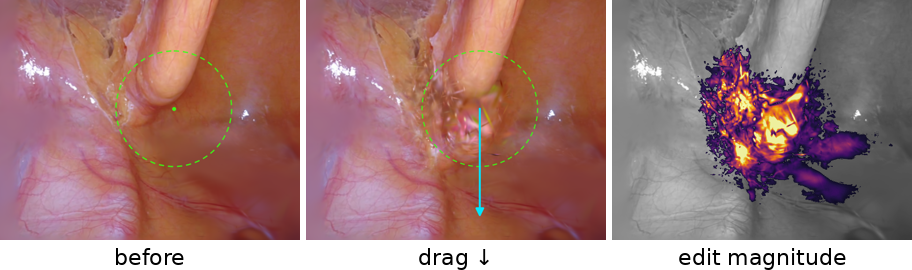
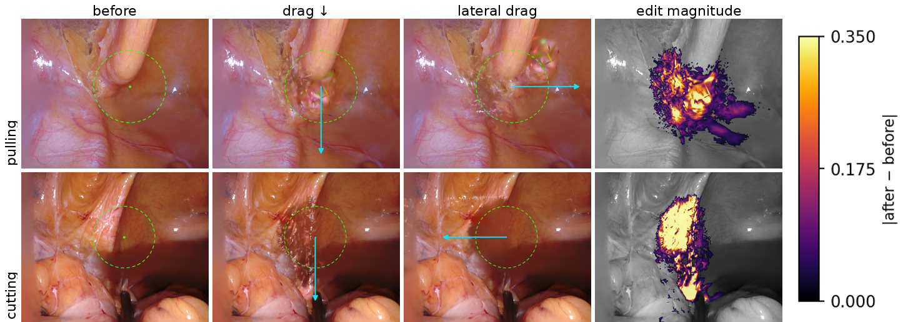

# Figure 2 — how to partially update it in Overleaf

You do **not** need to rewrite the whole figure. Below are the pictures and the
exact lines to change. Nothing existing is overwritten — the new panels are new
files, so just upload them alongside your current ones.

---

## Option A — minimal update (recommended): keep your 3-panel layout

Same single-column `figure`, same `minipage` structure. You only swap the **3 image
filenames**, tweak **2 sub-labels**, and replace the **caption**.

**Preview (before / drag / edit-magnitude):**



**Step 1 — upload these 3 new files** to your Overleaf `figures/` folder:
- `edit_gen_pulling_before.png`
- `edit_gen_pulling_down.png`
- `edit_gen_pulling_diff.png`

**Step 2 — change only the three `\includegraphics` lines.**

Replace:
```latex
\includegraphics[width=\linewidth,height=85pt]{figures/edit_before.png}\\[2pt]{\footnotesize before}
...
\includegraphics[width=\linewidth,height=85pt]{figures/edit_after.png}\\[2pt]{\footnotesize after}
...
\includegraphics[width=\linewidth,height=85pt]{figures/edit_diff.png}\\[2pt]{\footnotesize diff}
```
with:
```latex
\includegraphics[width=\linewidth,height=85pt]{figures/edit_gen_pulling_before.png}\\[2pt]{\footnotesize before}
...
\includegraphics[width=\linewidth,height=85pt]{figures/edit_gen_pulling_down.png}\\[2pt]{\footnotesize drag $\downarrow$}
...
\includegraphics[width=\linewidth,height=85pt]{figures/edit_gen_pulling_diff.png}\\[2pt]{\footnotesize edit magnitude}
```
(The `[width=\linewidth,height=85pt]` is unchanged, so the layout looks identical.
The panels are 640×512; if you want their true aspect ratio, drop `,height=85pt`.)

**Step 3 — replace the caption text** with:
```latex
\caption{Qualitative drag-to-edit example. An inference-time translation is applied
to a local group of control nodes and the same view is re-rendered without
retraining. \emph{Left:} reconstruction before editing; the dashed outline marks the
grabbed control-node region. \emph{Middle:} after dragging the handle downward (cyan
arrow shows the applied node translation). \emph{Right:} per-pixel edit magnitude
$\lVert I_{\mathrm{after}}-I_{\mathrm{before}}\rVert$, which stays localized to the
manipulated region. The example illustrates the locality of the weighted control
operation; it does not establish biomechanical validity.\label{fig:edit}}
```

That is the entire change: 3 filenames, 2 labels, 1 caption.

---

## Option B — generality version (2 scenes × 2 directions)

If you want the stronger "it generalizes" figure instead, this is a **full-width**
figure (`figure*`, 2 rows × 4 columns), so it is a larger edit.

**Preview:**



Files to upload: `edit_gen_{pulling,cutting}_{before,down,right,left,diff}.png` and
`edit_gen_colorbar.png`. The ready-to-paste block is in
[figure2_generality.tex](figure2_generality.tex) — replace your whole
`\begin{figure}...\end{figure}` edit block with it (and note it switches `figure` →
`figure*`).

---

## Quick reference — what each panel contains

| overlay | meaning |
|---|---|
| dashed green outline | the grabbed control-node region (the "handle") |
| cyan arrow | the applied inference-time node translation (drag direction) |
| `inferno` heatmap | per-pixel `‖after − before‖` (warmer = larger displacement) |

Sweet-spot magnitudes used: pulling ≈ `0.08`, cutting ≈ `0.12–0.16` of scene extent
(the paper's old `0.06` was invisible, `0.30` smeared). Full background is in
[EDIT_FIGURE_CHANGES.md](EDIT_FIGURE_CHANGES.md).
