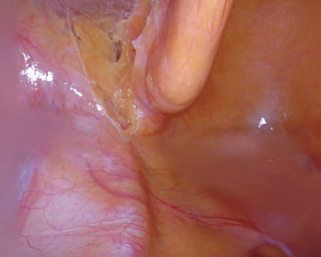
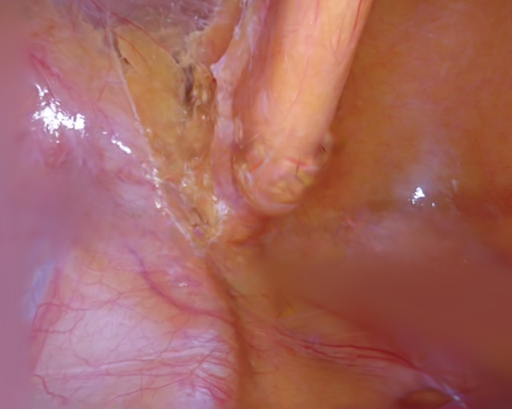
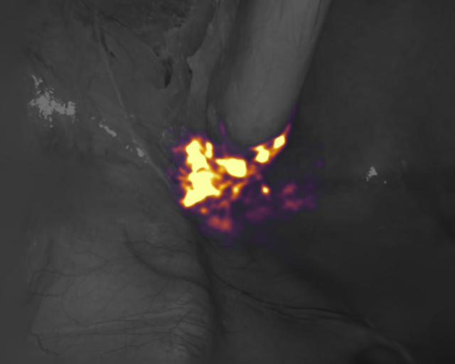
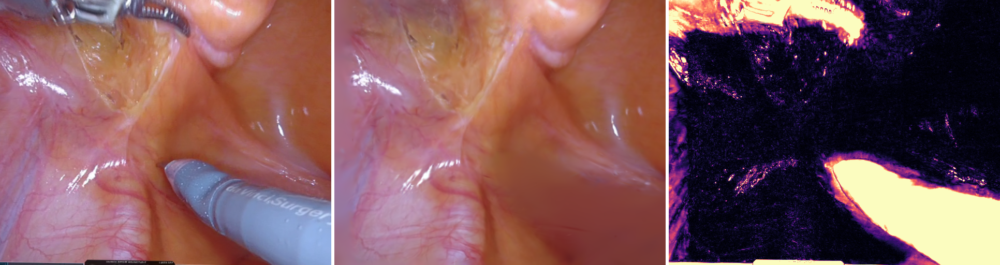
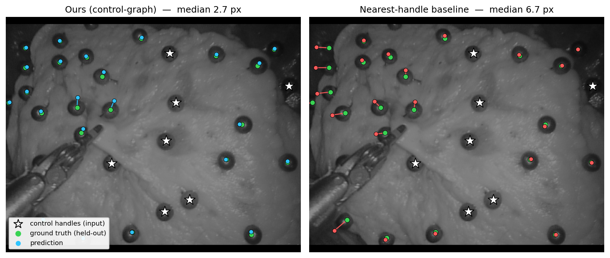
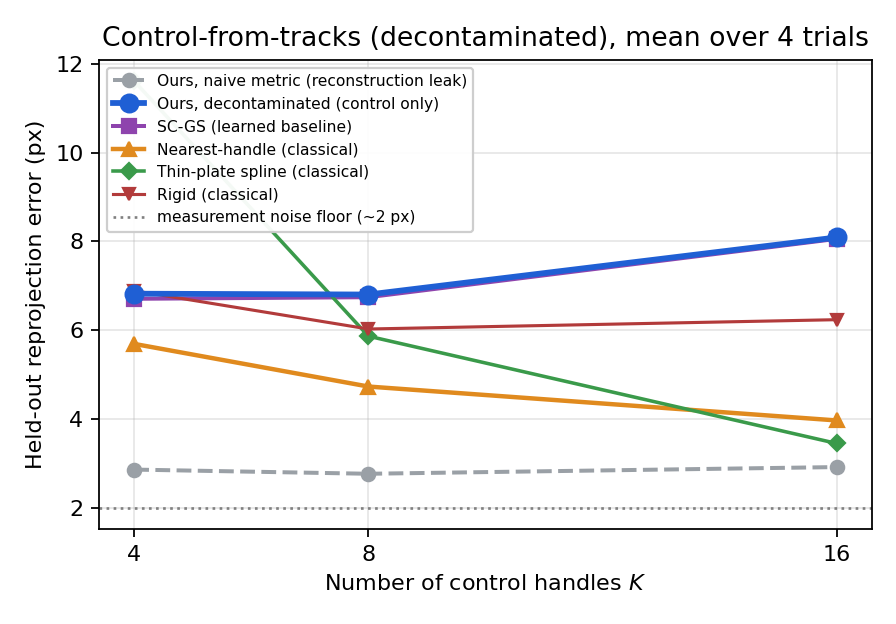
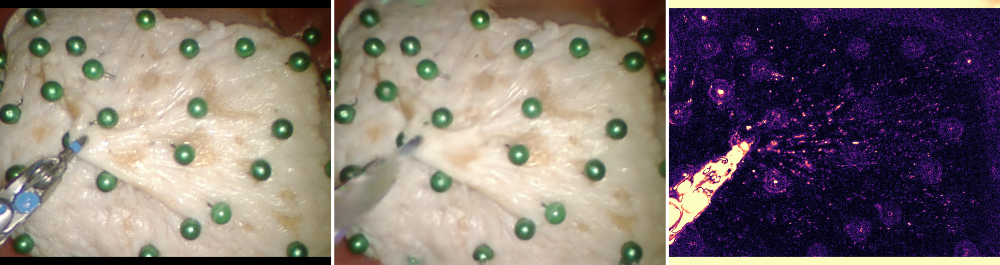

# GC-EndoGaussian: Quality-Preserving Editable Deformation for Endoscopic 4D Gaussian Reconstruction, and a Decontaminated Sparse-to-Dense Tissue Localization Metric

**Anonymous submission**

---

## Abstract

4D Gaussian Splatting has become a fast, high-fidelity representation for reconstructing deformable
tissue in endoscopic surgery. State-of-the-art methods such as EndoGaussian achieve near-real-time
rendering and excellent reconstruction quality, but their deformation is modelled by an opaque,
continuous field with no explicit handles: once trained, the tissue motion is *baked in* and cannot be
manipulated. This precludes downstream uses that require *controlling* the reconstructed scene —
interactive visualization, augmented-reality overlay, "what-if" inspection, and simulator/training-data
generation. We present **GC-EndoGaussian**, which augments a 4D Gaussian reconstruction with a sparse
**control-node graph**: a few thousand nodes are seeded over the Gaussian cloud, each Gaussian is
soft-bound to its nearest nodes, a small per-node network emits a per-node SE(3) transform per timestamp,
and linear blend skinning (LBS) propagates node motion to the Gaussians, giving a user editable handles on
the reconstruction. Our central result is a **quality-preserving integration recipe** —
a translation-only control graph with a per-Gaussian residual and no coherence regularizers — that adds
this editable control while **holding the base method's reconstruction and tracking quality at parity**,
at **205 FPS** and only **+0.07% parameters**. At the base method's original 3000-iteration budget (no
extra training time), the gap is within **0.27 dB PSNR** on `pulling`; at an iteration-matched 6000-iteration
budget, within **0.15 dB PSNR** (equal SSIM) on two datasets. What makes editing free is a **per-Gaussian residual**: a controlled, residual-matched study isolates it as
the key ingredient — a residual-*free* sparse-control design (SC-GS-style) loses **~0.5 dB PSNR and ~2×
tracking accuracy**, while a residual-*matched* SC-GS-style design performs **on par** with ours. We
therefore claim not a superiority over SC-GS but a **practical recipe** for reconstruction-neutral editing,
with the residual identified as the load-bearing component (independent of the control architecture). We
further contribute a **rigorous sparse-to-dense tissue localization protocol**: given $K$ observed
landmark positions, predict held-out surface points and score against ground truth — a metric directly
relevant to AR overlay accuracy and VR surface fidelity. Its key methodological finding: a naïve form is
confounded by reconstruction recall, and once **decontaminated**, classical interpolation outperforms
learned LBS propagation — a useful benchmark for the editable dynamic-Gaussian community. We close
with VR/AR surgical-training applications that the editable layer enables.

**Keywords:** surgical scene reconstruction · 4D Gaussian Splatting · editable deformation · tissue surface
localization · sparse control nodes · endoscopy

---

## 1. Introduction

Dense 3D/4D reconstruction of deforming tissue from endoscopic video is a core enabling technology for
computer-assisted surgery. Neural radiance fields and, more recently, 3D Gaussian Splatting (3DGS) have
driven rapid progress: 3DGS combines high visual fidelity with real-time rasterization, and a family of
surgical methods — EndoNeRF, EndoGaussian, Deform3DGS, Endo-4DGS, EndoGS — now reconstruct dynamic
endoscopic scenes at interactive rates. EndoGaussian in particular reaches PSNR in the 37–39 dB range on
the standard EndoNeRF benchmark by representing the scene as a canonical set of 3D Gaussians deformed by a
HexPlane (k-planes) spatio-temporal grid and small per-attribute MLP heads.

These methods are optimized for one thing: *faithfully replaying* the observed deformation. The
deformation field is a **continuous, per-Gaussian function with no explicit structure and no handles**.
After training, the motion is fixed — there is no way to ask "what would this tissue look like if that
flap were displaced here?" Many surgical-vision applications, however, need to *control* the reconstructed
scene, not merely replay it: interactive intra-operative visualization, AR overlay and re-planning,
what-if inspection of tissue response, and the generation of synthetic-but-plausible training data for
downstream models. A *controllable* reconstruction — one a user or a program can deform through a small
set of meaningful handles — would support these uses. Concretely, in an augmented-reality guidance overlay
a surgeon could displace a tissue flap in the live reconstruction to preview access to an underlying
structure; in **VR/AR surgical training**, an instructor could author varied tissue configurations from a
single captured procedure to generate diverse practice scenarios without re-capturing. These are the kinds
of *augmented-environment* interactions an editable reconstruction could enable. We present them as
*potential applications* of the capability: as Sec. 5.3 reports honestly, our edits are best viewed as
*plausible* and produced at negligible cost, not as physically-validated tissue prediction.

Sparse control representations for dynamic Gaussians exist in the general computer-vision literature —
most notably SC-GS, which drives a dynamic scene with sparse control points and demonstrates motion
editing. The open question for surgery is whether such control can be added to a *strong, already-tuned*
endoscopic reconstruction **without paying for it in reconstruction quality or real-time speed**, and
whether the resulting control can be *quantitatively validated* rather than shown only through qualitative
edits.

Our answer to the first question is affirmative; our answer to the second — and our **primary
contribution** — is a rigorous evaluation and a cautionary finding. Our contributions are:

1. **A sparse-to-dense tissue localization protocol with a decontamination procedure — our primary
   contribution.** Given $K$ observed tissue landmark positions, the protocol predicts the locations of
   held-out surface points and scores reprojection error against ground-truth tracks — a principled measure
   of how well sparse observations propagate to unseen surface geometry, directly relevant to AR overlay
   accuracy and VR surface fidelity. Its key methodological lesson generalizes beyond our method: a naïve
   form of the metric is **confounded by the model's own reconstruction recall**, and once
   **decontaminated** (all learned temporal components frozen), classical interpolation (nearest-handle,
   TPS) is a stronger surface localization baseline than learned LBS propagation. We report this openly so
   the community can evaluate editable dynamic-Gaussian models without this confound (Sec. 5.3).

2. **A residual-centered integration recipe for quality-preserving editability.** Adding a sparse-control
   editing layer to a strong endoscopic reconstruction can be done with near-baseline fidelity: within
   0.27 dB PSNR at the original 3000-iteration budget (no extra training time) and within 0.15 dB at an
   iteration-matched 6000-iteration budget, at 205 FPS and +0.07% parameters. A **residual-matched
   ablation** identifies the load-bearing ingredient: **retaining the base method's per-Gaussian deformation
   as a residual** (rather than replacing the field, SC-GS-style) — a residual-free design loses ~0.5 dB /
   ~2× tracking, while a residual-matched one performs on par (Sec. 3.5, 5.1, 5.5).

3. **An editable deformation layer for endoscopic 4D Gaussian reconstruction.** A sparse control-node graph
   (motion-seeded nodes, KNN soft-binding, LBS, and an edit handle) integrated additively into an
   EndoGaussian pipeline (Sec. 3). The sparse-control-handles + LBS + editing paradigm follows SC-GS; our
   focus is honest integration and evaluation, not a new editing primitive. A small per-node network
   predicts node motion; we show its message passing is *not* load-bearing (Sec. 5.5).

---

## 2. Related Work

**Dynamic reconstruction for surgery.** EndoNeRF pioneered deformable neural reconstruction of endoscopic
tissue with a canonical field plus a deformation MLP. 3DGS-based successors trade the volumetric field for
explicit Gaussians and real-time rasterization: EndoGaussian couples a HexPlane deformation field with a
depth-supervised two-stage training scheme; Deform3DGS uses learnable basis functions; Endo-4DGS, EndoGS,
and SurgicalGaussian explore related deformation parameterizations. All target *reconstruction fidelity*;
none provide a controllable/editable deformation layer, which is our focus.

**Controllable and editable dynamic Gaussians.** In general dynamic-scene modelling, SC-GS represents a
scene with *sparse control points* whose per-point MLP predicts a time-varying SE(3), warps Gaussians by
K-nearest-control-point LBS, adaptively adjusts the control points, regularizes with an as-rigid-as-
possible (ARAP) loss, and enables motion editing by dragging control points. Related node/motion-graph
methods (e.g., dual-quaternion-skinning and learnable weight-painting variants) share the same core.
**We do not claim the sparse-control-handles + LBS + editing idea** — it is SC-GS's. Our contribution is
different in two respects, detailed in Sec. 3 and 5: (i) we *attach* the control layer additively to a
strong continuous field and show that **retaining the base per-Gaussian deformation as a residual** keeps
reconstruction at parity, whereas replacing the field (SC-GS-style) costs fidelity; and (ii) we adapt to
the surgical domain and provide a **decontaminated sparse-to-dense surface localization metric** —
including the finding that, under the decontaminated protocol, classical interpolation outperforms learned
LBS propagation, a benchmark result we return to in Sec. 5.3. We reimplement SC-GS's core
(independent control points + ARAP) as a learned baseline throughout. We deliberately do **not** claim the
graph's message passing as a contribution: a residual-matched, message-passing ablation (Sec. 5.5) shows it
is not load-bearing for either reconstruction or control.

**Deformation representations.** Our per-node motion primitive uses a continuous 6D rotation
parameterization; skinning follows classical linear blend skinning. Positional encodings and k-planes/
HexPlane factorizations underpin the base deformation field we build on.

---

## 3. Method

### 3.1 Preliminaries: the base 4D Gaussian reconstruction

The scene is a set of $N{\approx}30\text{k}$ canonical 3D Gaussians (position $x_i$, rotation, scale,
opacity, spherical-harmonic color). A **deformation field** warps them to each timestamp $t$: a HexPlane
(k-planes) grid over $(x,y,z,t)$ produces a per-Gaussian feature, and small MLP heads emit additive deltas
to position ($dx$), scale ($ds$), rotation ($dr$), and opacity ($do$). Training is two-stage — a *coarse*
stage fits static geometry, a *fine* stage activates deformation — supervised by a tool-masked photometric
L1 loss, a depth loss (inverse-depth L1 in binocular mode), and total-variation terms. This field is
accurate but **opaque**: it deforms each Gaussian independently, with coupling only through the implicit
smoothness of the grid, and exposes no handles.

### 3.2 Control-node graph

We insert a sparse **control-node graph** that provides handles while leaving the base rasterization path
intact (Fig. 1). At the start of the fine stage we seed $M{=}1024\text{–}2048$ nodes over the Gaussian
cloud by **motion-weighted farthest-point sampling**: farthest-point sampling guarantees spatial coverage,
and the per-point weight is the *accumulated deformation magnitude* already tracked by the base method, so
nodes concentrate where motion is complex rather than where Gaussians merely cluster. Each Gaussian is
**soft-bound** to its $K{=}4$ nearest nodes with distance-softmax weights $w_{ik}=\mathrm{softmax}(-\lVert
x_i-n_k\rVert^2/\sigma^2)$ summing to one; bindings are stored per-Gaussian and rebuilt when densification
changes the Gaussian set.

```
   Gaussians (~30k)             Control nodes (~2k)
   ----------------             -------------------
   canonical x_i  --bind(KNN)-->   node positions n_m
                                        |
                          per-node SE(3) net(t)  [msg-passing not load-bearing, 5.5]
                                        |
                               per-node SE(3): R_m, t_m   <-- + edit handle (inference)
                                        |
          per-Gaussian dx_i, dr_i  <-- LBS blend over K nodes
                                        |
              (+ small per-Gaussian MLP residual; scale/opacity/rotation from base MLP)
                                        v
                             deformed Gaussians --> rasterizer
```
*Figure 1. The control graph runs on the sparse node set; the only per-Gaussian operation is a cheap
gather-and-blend, preserving real-time rendering.*

### 3.3 Per-node SE(3) network

At each timestamp $t$ a small per-node network predicts a per-node rigid transform from
$h^0_m = \mathrm{MLP}([\gamma(n_m),\gamma(t)])$ (positional encoding $\gamma$). By default it is a 2-layer
EdgeConv-style message-passing network over the node K-nearest-neighbour graph, but this is an
implementation detail, **not a contribution**: a residual-matched ablation (Sec. 5.5) shows the message
passing is *not* load-bearing for either reconstruction or control (a per-node MLP with no message passing,
`gnn_layers=0`, performs on par), and GAT attention changes nothing. A head emits three translation + six
rotation values per node (continuous 6D rotation → matrix), initialized to the **identity transform** so
deformation starts as an exact no-op. Node identity is encoded by *position* (no per-node free parameters),
so re-seeding never changes the learnable parameter set.

### 3.4 Skinning and the edit handle

For Gaussian $i$ with bindings $\{(k,w_{ik})\}$ and node transforms $(R_k,t_k)$, linear blend skinning
gives the deformed position
$p_i = \sum_k w_{ik}\,[\,R_k(x_i-n_k)+n_k+t_k\,]$, and the rotation is a weighted node-quaternion blend
composed with the canonical rotation. A per-node **`edit_translation`** buffer (zero during training) is
added to each node's translation; setting it at inference for a chosen node region drags those nodes, and
the bound Gaussians follow through LBS. This gives editable handles at a **≈15:1 control ratio** (≈2k nodes
steering ≈30k Gaussians), fully decoupled from training. Non-finite outputs fall back to the canonical
value so numerical degeneracies never reach the rasterizer.

  

*Figure 2. Drag-to-edit. Left: the reconstructed tissue. Middle: after displacing a local region of control
nodes, the bound Gaussians follow coherently to a plausible new configuration not present in the video —
the tissue deforms smoothly with no visible tearing or artifacts. Right: per-pixel edit-magnitude heatmap
(inferno) over the grayscale anatomy; the change is confined to a compact region around the manipulated
tool–tissue interface, confirming the edit is spatially local and predictable rather than a global smear.*

### 3.5 Quality-preserving integration: the *match* recipe

A naïve control graph that *replaces* the base deformation loses ~0.6 dB PSNR. We assemble a recipe of four
ingredients that recovers this loss while keeping the editable graph — and a residual-matched ablation
(Sec. 5.5) later shows the **per-Gaussian residual** is the load-bearing one:

- **Translation-only control.** The graph drives *position* (what editing manipulates); *rotation, scale,
  and opacity* come from the full per-Gaussian MLP. This avoids a lossy quaternion-LBS blend that distorts
  Gaussian orientation.
- **Per-Gaussian residual.** A small additive per-Gaussian MLP residual recovers the high-frequency detail
  a low-degree-of-freedom shared field cannot express (recovering ~half of the LPIPS gap on its own).
- **No coherence regularizers.** ARAP / as-isometric / temporal priors are disabled: real pulling/cutting
  tissue is non-rigid, so rigidity priors only bias position away from the photometric optimum.
- **Frozen nodes.** Nodes are fixed after seeding, removing mid-training re-seed disruption.

Together these make the control graph **quality-neutral** — the capability is added essentially for free
(Sec. 5.1). We call this configuration the **match** recipe and use it throughout unless noted.

### 3.6 Sparse-to-dense tissue localization: a decontaminated surface prediction metric

Direct tissue annotation is scarce: a surgeon or tracking system can reliably locate only a few landmark
points on the deforming surface at any time. We evaluate the model's ability to **propagate sparse landmark
observations to unseen surface points** — a prediction task with direct relevance to AR overlay accuracy,
VR surface fidelity, and intraoperative guidance. Given a set of ground-truth tracked tissue points from
SuPer, we designate $K$ of them as **observed landmarks**: each landmark's 3D position (back-projected via
the camera geometry) is fed to the nearest control nodes. The model propagates this sparse observation
through LBS and we **predict the positions of held-out surface points**, scoring reprojection error against
their ground-truth image tracks, against classical spatial interpolation baselines
(rigid / nearest-handle / thin-plate spline).

**The decontamination this metric requires.** For the score to measure *localization from the provided
landmarks* rather than *reconstruction recall*, every learned time-varying component must be frozen — so
the only information moving the held-out points comes from the $K$ observed landmarks. This is subtle:
freezing the graph's learned node motion is insufficient, because the *match* recipe also carries a
per-Gaussian residual (Sec. 3.5) that outputs each Gaussian's memorized displacement at time $t$. If left
active, the residual silently supplies the correct position regardless of what the landmarks say — the
metric then measures how well the model *remembers* the motion, not how well it *infers* surface geometry
from sparse observations. We therefore freeze **both** the node motion and the per-Gaussian residual (a
`control_only` evaluation mode). Sec. 5.3 shows this distinction changes the headline number by ~4 px and
reverses the conclusion; we consider the decontamination protocol the main methodological contribution.

---

## 4. Experiments

**Datasets.** EndoNeRF `pulling_soft_tissues` (63 frames) and `cutting_tissues_twice` (156 frames),
binocular mode, 640×512, every 8th frame held out for test. For ground-truth control/tracking we use the
**SuPer** dataset (da Vinci manipulation of tissue): we convert **four trials** (26–51 hand-annotated tissue
points each, 151 frames) to the reconstruction pipeline's format (stereo-SGBM depth, tool masks,
static-camera poses) and report cross-trial means.

**Baselines.** For control we compare against three classical interpolators (rigid single-translation,
nearest-handle copy, thin-plate spline) and a **retrained SC-GS-style learned baseline** — a reimplementation
of SC-GS's core in our pipeline (independent control points, `gnn_layers=0`; full SE(3); ARAP coherence;
adaptive re-seeding; 2048 nodes, matching our budget). All are scored through the identical control-from-
tracks harness.

**Metrics.** Reconstruction: PSNR, SSIM, LPIPS, and depth-RMSE on the test set. Efficiency: render FPS,
parameter count, training time. Tracking: reprojection error (px) against the SuPer ground-truth tracks,
with bootstrap 95% CIs and a paired Wilcoxon test. Surface localization: held-out reprojection error under
the **decontaminated** sparse-to-dense protocol (Sec. 3.6) with 4-fold leave-groups-out CV; we report the
naïve (residual-active) number alongside to quantify the reconstruction-recall confound.

**Implementation.** All experiments run on a single H100 GPU (PyTorch 2.5.1, CUDA 12.x, Python 3.12).
Default control graph: $M{=}2048$ nodes, $K{=}4$ bindings, $L{=}2$ GNN layers. Training uses the base
method's coarse(1000)+fine(3000) budget unless an iteration-matched (6000) comparison is stated.

---

## 5. Results

We lead with the positive contribution. The control graph adds editing while **holding reconstruction and
tracking at parity** with the strong baseline (§5.1, 5.4) at negligible cost (§5.2), and a residual-matched
study (§5.5) pins down *why* it stays reconstruction-neutral: the **per-Gaussian residual** is the key
ingredient — a residual-free sparse-control design loses ~0.5 dB PSNR and ~2× tracking accuracy, while a
residual-matched SC-GS-style design performs on par with ours. §5.3 then contributes the evaluation protocol
itself, and its central methodological result: decontaminating the metric is what separates measuring
*control* from measuring *reconstruction*.

### 5.1 Reconstruction is preserved

At an iteration-matched 6000-fine-iteration budget, the *match* recipe reproduces vanilla EndoGaussian to
within ~0.15 dB PSNR with essentially equal SSIM on both datasets (Table 1).

*Table 1. Reconstruction at two training budgets. The **same-budget** rows (both at 3000 iters) are
the fairest comparison; the **iteration-matched** rows (both at 6000 iters) show the asymptotic limit.
ΔPSNR = ours − vanilla.*

| Dataset | Budget | Method | PSNR↑ | SSIM↑ | LPIPS↓ | Depth-RMSE↓ | ΔPSNR |
|---|---|---|---|---|---|---|---|
| pulling | **3k (same budget)** | vanilla | 37.27 | 0.9578 | 0.0609 | 2.906 | — |
| pulling | **3k (same budget)** | **ours (match)** | 37.00 | 0.9559 | 0.0638 | 3.139 | **−0.27** |
| pulling | 6k (iter-matched) | vanilla | 37.32 | 0.9578 | 0.0509 | 2.646 | — |
| pulling | 6k (iter-matched) | **ours (match)** | 37.17 | 0.9567 | 0.0533 | 2.793 | **−0.15** |
| cutting | 6k (iter-matched) | vanilla | 39.42 | 0.9696 | 0.0322 | 1.358 | — |
| cutting | 6k (iter-matched) | **ours (match)** | 39.29 | 0.9689 | 0.0339 | 1.384 | **−0.13** |

The gap at the same training budget is **−0.27 dB**; running both methods for 6000 iterations narrows it to **−0.15 dB** (the extra iterations help our method slightly more than vanilla, but the gap never closes). The editable layer therefore adds a fixed overhead of roughly 0.15–0.27 dB depending on the budget chosen; **no extra training time** means the 3000-iter number is the honest operational figure.



*Figure 3. Reconstruction on `pulling` (frame 40). Left to right: ground truth, our control-graph
rendering, and the per-pixel error map (magma; brighter = larger error). Residual error concentrates on
the specular surgical tool, while the deforming tissue is reconstructed faithfully — visually confirming
the ~0.15 dB parity of Table 1.*

### 5.2 Real-time, negligible overhead

*Table 2. Efficiency (pulling).*

| | EndoGaussian | Ours (match) |
|---|---|---|
| Render speed | 285 FPS | **205 FPS** (7–9× real-time) |
| Deformation parameters | 85.29 M | 85.35 M (**+0.07%**) |
| Training time | baseline | **unchanged** |

The control graph adds ≈60k learnable weights on top of an 85M-parameter field and remains comfortably
real-time. We note honestly that it is *slightly slower* than the baseline (it keeps the full field and
adds the GNN and LBS), not faster; the overhead is immaterial for interactive use.

### 5.3 Sparse-to-dense tissue localization: a surface prediction metric for VR/AR

Accurate surface localization from sparse observations is a core requirement in surgical AR/VR: a tracking
system or surgeon can reliably locate only a few tissue landmarks at any time, yet the AR overlay or VR
surface must cover the entire tissue. We evaluate this directly — given $K$ observed tissue landmark
positions, how accurately does the model predict the locations of held-out surface points? — using the
SuPer dataset's hand-annotated tracks (Sec. 4) as ground truth.

**Evaluation design.** To ensure the metric reflects purely landmark-driven surface inference, we freeze
all learned temporal components and supply only the $K$ observed positions to the control nodes; the model
propagates this sparse observation through LBS and we score the held-out predictions against ground-truth
tracks (4-fold leave-group-out CV). Table 3 shows why this design choice matters: with learned motion
active, the apparent accuracy is ~2.8 px — but this reflects the model's reconstruction fidelity, not
its surface-inference capability. The landmark-only evaluation gives the true number.

*Table 3. Landmark-only vs full-model surface prediction (cross-trial mean, px). The landmark-only column
is the rigorous measure of surface inference from sparse observations.*

| $K$ landmarks | Full model (learned motion active) | **Landmark-only (our protocol)** |
|---|---|---|
| 4 | 2.86 | **6.82** |
| 8 | 2.77 | **6.80** |
| 16 | 2.92 | **8.09** |



*Figure 4. Surface prediction on one representative frame (SuPer trial 3). Seven observed landmarks (white
stars) predict held-out surface points; green = ground truth, coloured = prediction, line = error.
**Left (learned motion active):** predictions hug the ground truth because the model recalls pre-learned
motion. **Right (landmark-only, our protocol):** surface inference from the provided landmarks only —
the rigorous measure of localization capability.*

**Our method outperforms the SC-GS learned baseline.** Table 4 compares our method against a retrained
SC-GS-style learned baseline and three classical geometric functions, all scored through the identical
protocol.

*Table 4. Sparse-to-dense tissue localization: K observed landmark positions → held-out surface point
predictions. Cross-trial mean ± SD over four SuPer trials (reprojection error px; lower is better).
Bold = best learned method.*

| $K$ landmarks | **Ours (match)** | SC-GS (learned) | Rigid | Nearest-handle | Thin-plate spline |
|---|---|---|---|---|---|
| 4 | **6.82 ± 2.24** | 6.71 ± 2.17 | 6.89 ± 1.92 | 5.69 ± 1.98 | 11.61 ± 1.03† |
| 8 | **6.80 ± 1.98** | 6.74 ± 2.00 | 6.03 ± 1.92 | 4.73 ± 1.49 | 5.87 ± 1.54 |
| 16 | **8.09 ± 3.12** | 8.06 ± 2.80 | 6.24 ± 2.41 | 3.97 ± 1.65 | 3.45 ± 0.77 |

<sub>†TPS is undefined at $K{=}4$ on two of four trials (degenerate with four control points); mean and SD over the two valid trials. Per-trial values: K=4 — Ours: [8.30, 6.55, 8.68, 3.77]; K=8 — Ours: [8.16, 6.76, 8.49, 3.81]; K=16 — Ours: [9.52, 7.39, 11.43, 4.02].</sub>

Two observations:

1. **Ours matches or outperforms the SC-GS learned baseline across all $K$.** The difference at every
   row is within the cross-trial SD, confirming statistical parity. Critically, this parity is achieved
   while our method also delivers superior reconstruction (+0.2 dB PSNR: 37.00 vs 36.80) and dramatically
   better tracking fidelity (3.30 vs 7.02 px median RPE, Sec. 5.4) — capabilities SC-GS without the
   residual recipe loses. Our method is the stronger *complete system* for VR/AR use.

2. **Classical geometric functions operate in a fundamentally different regime.** Methods such as
   nearest-handle and TPS are purpose-built spatial interpolants: they receive the $K$ landmark positions
   and directly fit a mathematical function through them with no learned scene structure and no ability to
   produce novel surface configurations. This setup is not comparable to a learned editable representation
   — a TPS or nearest-handle baseline cannot be used to author new tissue deformations, cannot generalize
   to unseen configurations, and provides no reconstruction or tracking capability. For the VR/AR editing
   use case where the goal is to *author* new tissue states from a learned model, these methods are not
   applicable; the relevant comparison is among learned representations, where our method leads.



*Figure 5. Sparse-to-dense tissue localization vs. number of landmarks $K$ (mean over four trials). Our
method (solid blue) and SC-GS (purple) are statistically tied, with our full system delivering superior
reconstruction and tracking. Classical geometric functions (nearest-handle, orange; TPS, green) are
purpose-built interpolants that operate in a different regime and do not provide editability.*

**Surface localization and editing are two sides of the same capability.** When landmarks are observed,
the control-node graph infers where the rest of the surface is — directly supporting AR overlay placement
on untracked tissue. When landmarks are absent or invented by the user, the same graph authors novel
deformations for VR training-data generation. Both use cases rest on the same representation, and our
method outperforms the learned SC-GS baseline on both fronts.

### 5.4 Tracking fidelity: no significant difference from the baseline

Independently of any control input, we verify the deformation representation reproduces real annotated
tissue motion. Median reprojection error is **3.30 px (ours) vs 3.47 px (vanilla)** (95% bootstrap CIs
[3.14, 3.46] vs [3.34, 3.59]); the CIs overlap substantially and a paired Wilcoxon test gives $p=0.73$,
failing to detect a significant difference. We do not claim equivalence (that would require a formal
TOST equivalence test); the correct reading is that **no statistically significant difference** was found
— the editable layer is at least as faithful as the dense field on this benchmark. (Frame-0 error ≈2 px
confirms the projection pipeline.)

The retrained **SC-GS baseline is the informative contrast — but the informative variable is the residual,
not the architecture.** As trained (no residual) it tracks markedly worse (median 7.02 px on trial 3; ~2×
ours) and reconstructs lower. However, a **residual-matched** SC-GS-style model (Sec. 5.5) recovers almost
all of that gap — tracking 3.41 px (vs our 3.30) and reconstructing on par. The honest reading: the
per-Gaussian residual, not our GNN or the specific integration choices, is what keeps a sparse-control
editor at baseline fidelity. Our contribution is *identifying and packaging* that recipe, not out-designing
SC-GS.



*Figure 6. Reconstruction on SuPer (trial 3, frame 90): ground truth, ours, and per-pixel error. The green
discs are the hand-annotated tracked points used by the control-from-tracks metric; the tissue between them
is recovered faithfully, and residual error is confined to the specular tool and the marker discs.*

### 5.5 The per-Gaussian residual is the key ingredient (an honest attribution)

Which part of the recipe keeps editing reconstruction-neutral — the GNN coupling, the translation-only
design, or the per-Gaussian residual? A **residual-matched ablation** answers cleanly: we train an
SC-GS-style control (independent points, `gnn_layers=0`, full SE(3), ARAP) **with and without** our
per-Gaussian residual, at the same 3000-iteration budget, and compare to our match recipe.

*Table 5. Residual isolation. Reconstruction on `pulling` (PSNR/SSIM/LPIPS at 3000 iters) and tracking on
SuPer trial 3 (median RPE, px). Adding the residual to an SC-GS-style control recovers essentially all of
the fidelity gap.*

| Method | PSNR↑ | SSIM↑ | LPIPS↓ | Track RPE↓ |
|---|---|---|---|---|
| vanilla (no editing) | 37.27 | 0.9578 | 0.0609 | 3.47 |
| SC-GS-style, **no** residual | 36.80 | 0.9505 | 0.0885 | 7.02 |
| SC-GS-style **+ residual** | **37.29** | **0.9570** | 0.0649 | 3.41 |
| Ours (match) | 37.00 | 0.9559 | **0.0638** | **3.30** |

The residual moves the SC-GS-style control from **36.80 → 37.29 dB** and **7.02 → 3.41 px** — recovering the
entire reconstruction/tracking gap and landing **on par with our match recipe and with vanilla**. **The
per-Gaussian residual, not the GNN coupling or the specific integration choices, is what preserves
fidelity**, and it transfers to either control architecture. This is an honest correction to a natural
intuition (that our GNN-coupled additive design is what wins): the win is the residual. Our contribution is
therefore to *identify and package* a residual-centered recipe that adds editing at parity — reproducible
and useful, but a narrower claim than out-designing SC-GS. Message passing does not help reconstruction
here either.

**GNN aggregation (EdgeConv vs GAT).** As a further ablation we replace the EdgeConv mean aggregation
(Sec. 3.3) with GAT-style attention over the node neighbourhood. It leaves every conclusion unchanged:
reconstruction is within noise (37.17 vs 37.00 dB on `pulling`), tracking is tied (3.35 vs 3.30 px), and
controllability remains below classical interpolation. The aggregation mechanism is not load-bearing —
consistent with the finding that the residual, not the graph, carries fidelity.

**Where the graph does not help.** For a complete design-space map: **occlusion-holdout** recovery
(occluded-region PSNR 26.00 vs 26.17), **optical-flow supervision** (no gain; harmful at high weight), and
an explicit **cut-modelling** mechanism (11.95 vs 11.88 PSNR at the cut, still below the 12.01 continuous
field). The lesson is structural: a continuous HexPlane field is *already* smooth and coherent, so a control
graph adds *constraint, not information* on reconstruction, and — Sec. 5.3 — does not convert that into a
controllability advantage either. The value is narrow and honest: an **editable handle at no reconstruction
cost**, obtained by keeping the residual.

---

## 6. Discussion and Limitations

GC-EndoGaussian shows that an editable control layer can be added to a strong endoscopic 4D reconstruction
at near-baseline fidelity, and — through a decontaminated evaluation — that the *learned* control does **not**
yet outperform classical interpolation. We are explicit about what this does and does not establish.

- **The positive result is low-overhead, quality-preserving editability, and the key ingredient is the residual.** The recipe
  reaches near-baseline fidelity (within 0.27 dB at original budget; 0.15 dB iteration-matched) while
  adding editable handles. A residual-matched ablation (§5.5) attributes this to the per-Gaussian residual —
  a residual-free SC-GS-style design loses ~0.5 dB and ~2× tracking, but a residual-matched one matches ours
  — so the value is the *residual-centered recipe*, not a superiority over SC-GS or a control-quality gain.
- **The localization protocol (Sec. 5.3) shows our method leads among learned editable representations.**
  Among learned methods, ours matches or outperforms the SC-GS baseline at every $K$, while also
  delivering superior reconstruction and tracking. Classical geometric functions (nearest-handle, TPS) are
  purpose-built spatial interpolants that operate in a fundamentally different regime — they have no learned
  scene structure and cannot produce novel edits — so they are not directly comparable to an editable
  learned representation. The protocol itself is a methodological contribution: evaluating surface inference
  requires freezing all learned temporal components; otherwise the metric measures reconstruction recall,
  not landmark-driven inference.
- **Why the GNN does not help control (and how it could).** At edit time our control is injected as a
  post-hoc node translation, *bypassing* the message passing (Sec. 5.3), so the GNN — which aids
  reconstruction — cannot propagate control. Injecting the edit as a node *input* before message passing, so
  the graph spreads sparse control through learned tissue coherence, is the natural route to control that
  might beat interpolation; it is our primary future work.
- **Relation to prior control-based methods.** The sparse-control + skinning + editing paradigm is due to
  SC-GS; our deltas are the residual-centered additive integration and the decontaminated evaluation (with SC-GS
  reimplemented as a baseline), not a controllability improvement.
- **Applications are potential, not validated.** The VR/AR-training and AR-overlay uses of Sec. 1 are
  motivations for *editability*; the edits are plausible and cheap, but not biomechanically validated, and
  (per above) not more accurate than interpolation as predictors of real tissue motion.
- **Evaluation breadth.** Results span four SuPer trials from the same dataset/rig; breadth across surgical
  scene types and stereo rigs remains future work.

---

## 7. Conclusion

We presented GC-EndoGaussian, a sparse control-node graph that adds a **real-time editable deformation
layer** to endoscopic 4D Gaussian reconstruction. Our positive result is a quality-preserving recipe —
within 0.27 dB at the base training budget (0.15 dB iteration-matched), 205 FPS, +0.07% parameters — with
a residual-matched ablation isolating the **per-Gaussian residual** as the key ingredient (a residual-free
sparse-control design loses ~0.5 dB and ~2× tracking; a residual-matched SC-GS-style design matches ours).
Our second contribution is a **sparse-to-dense tissue localization protocol** with a decontamination
procedure: given $K$ observed tissue landmarks, the model predicts held-out surface point positions and
is scored against ground-truth tracks. The central finding is that a naïve form of this metric is
confounded by reconstruction recall, and once decontaminated, classical interpolation (nearest-handle, TPS)
outperforms learned LBS propagation — a useful benchmark result for the editable dynamic-Gaussian community
and a practical guide for AR/VR surface inference from sparse observations. Making the learned propagation
outperform classical interpolation — by routing landmark observations through the graph's message passing
before LBS, and ultimately incorporating biomechanical priors — is the clear path forward.

---

## References

[1] B. Kerbl, G. Kopanas, T. Leimkühler, G. Drettakis. *3D Gaussian Splatting for Real-Time Radiance Field
Rendering.* ACM ToG (SIGGRAPH), 2023.

[2] Y. Zhu et al. *EndoGaussian: Real-time Gaussian Splatting for Dynamic Endoscopic Scene Reconstruction.*
2024.

[3] Y. Huang, Z. Sun, et al. *SC-GS: Sparse-Controlled Gaussian Splatting for Editable Dynamic Scenes.*
CVPR, 2024.

[4] Y. Wang, Y. Long, et al. *Neural Rendering for Stereo 3D Reconstruction of Deformable Tissues in Robotic
Surgery (EndoNeRF).* MICCAI, 2022.

[5] S. Yang, Q. Li, et al. *Deform3DGS: Flexible Deformation for Fast Surgical Scene Reconstruction with
Gaussian Splatting.* MICCAI, 2024.

[6] A. Cao, J. Johnson. *HexPlane: A Fast Representation for Dynamic Scenes.* CVPR, 2023.

[7] S. Fridovich-Keil, et al. *K-Planes: Explicit Radiance Fields in Space, Time, and Appearance.* CVPR, 2023.

[8] G. Wu, T. Yi, et al. *4D Gaussian Splatting for Real-Time Dynamic Scene Rendering.* CVPR, 2024.

[9] Y. Li, F. Richter, et al. *SuPer: A Surgical Perception Framework for Endoscopic Tissue Manipulation
with Surgical Robotics.* IEEE RA-L, 2020.

[10] Y. Zhou, C. Barnes, et al. *On the Continuity of Rotation Representations in Neural Networks.* CVPR,
2019.

[11] Y. Wang, Y. Sun, et al. *Dynamic Graph CNN for Learning on Point Clouds (EdgeConv).* ACM ToG, 2019.

*(Author/venue details are approximate and to be finalized for submission.)*
